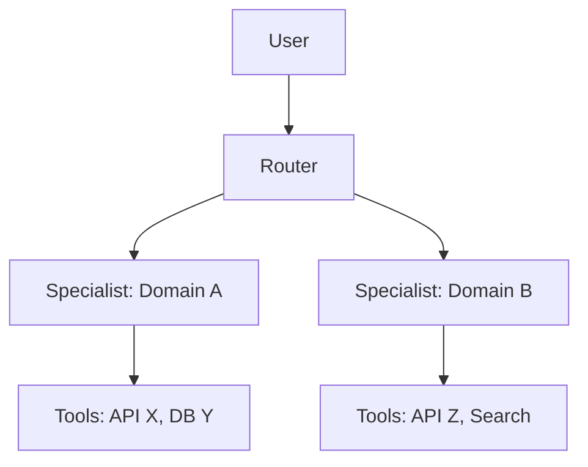

# Design AI Agent

Guides the user through designing an AI agent system from scratch, applying patterns from "Patterns for Building AI Agents" (Bhagwat & Gienow, 2025). Covers agent capability mapping, architecture evolution, dynamic configuration, and human-in-the-loop design.

## When to use

Use this skill when the user needs to:
- Design a new AI agent or multi-agent system from scratch
- Break down a complex automation into agent capabilities
- Decide on agent architecture (single vs. multi-agent, router, coordinator)
- Plan human-in-the-loop checkpoints
- Configure dynamic agent behavior based on user context

## Instructions

### Step 1: Understand the Domain

Use the `AskUserQuestion` tool to gather context:
1. What problem domain will the agent operate in? (e.g., customer support, code generation, data analysis)
2. Who are the end users? (developers, business users, customers)
3. What systems/APIs/data sources will the agent interact with?
4. What is the risk tolerance? (low = needs heavy HITL, high = can be autonomous)

Do not proceed until the domain is clear.

### Step 2: Whiteboard Agent Capabilities (Pattern 1)

Guide the user through a capability mapping exercise:

1. **Brainstorm** — Ask the user to list everything they want the agent to do. Use `AskUserQuestion` to prompt for capabilities in batches. Be comprehensive.
2. **Group** — Cluster similar capabilities by:
   - Same data sources or APIs
   - Same "job title" (if a human did this, what role would they have?)
   - Same step in a business process
3. **Divide** — Identify natural boundaries:
   - Different departments or teams
   - Different task types (research vs. execution vs. review)
   - Different data access needs
4. **Assign** — Map capability groups to distinct agent roles
5. **Prioritize** — Rank agents by business impact. Ask the user to pick the top priority.

Output a capability map:

```markdown
## Agent Capability Map

### Agent 1: [Name] (Priority: HIGH)
- **Role:** [What this agent does]
- **Capabilities:**
  - [ ] [Capability 1]
  - [ ] [Capability 2]
- **Tools/APIs:** [What it needs access to]
- **Data sources:** [What data it reads/writes]

### Agent 2: [Name] (Priority: MEDIUM)
...
```

### Step 3: Evolve Architecture (Pattern 2)

Based on the capability map, recommend an architecture. Apply the evolutionary principle: **start simple, split when needed**.

Use `AskUserQuestion` to present architecture options:

| Architecture | When to use |
|---|---|
| **Single Agent** | < 5 tools, one domain, simple workflow |
| **Router + Specialists** | Multiple domains, user intent varies |
| **Coordinator + Workers** | Multi-step workflows, tasks depend on each other |
| **Pipeline** | Sequential processing stages |

**Key rules:**
- Start with ONE agent solving the highest-priority problem
- Only add agents when the single agent becomes unwieldy
- Performance degrades as tool count increases — split at ~10-15 tools
- Add routing logic only when you have multiple specialists

Generate an architecture diagram in Mermaid:



### Step 4: Dynamic Configuration (Pattern 3)

Identify runtime signals that should change agent behavior. Use `AskUserQuestion` to explore:

1. **User tiers** — Do free/pro/enterprise users get different behavior?
2. **User roles** — Does an admin vs. viewer change available actions?
3. **Session state** — Should the agent adapt based on conversation history?
4. **Environment** — Dev vs. staging vs. production differences?

For each signal, define what changes:
- Model selection (faster/cheaper vs. more capable)
- Tool availability (restricted vs. full access)
- Retrieval settings (topK, data sources)
- Response style (concise vs. detailed)

Output a configuration matrix:

```markdown
## Dynamic Configuration Matrix

| Signal | Value | Model | Tools | Retrieval | Style |
|--------|-------|-------|-------|-----------|-------|
| User tier | Free | haiku | basic | topK=3 | concise |
| User tier | Pro | sonnet | full | topK=10 | detailed |
| User tier | Enterprise | opus | full + custom | topK=20 | detailed |
```

### Step 5: Human-in-the-Loop Design (Pattern 4)

For each agent, determine where humans should be involved. Use `AskUserQuestion` to assess risk:

**Three HITL modes:**

1. **In-the-loop** — Agent pauses mid-execution for human approval before proceeding
   - Use for: irreversible actions, financial transactions, external communications
2. **Post-processing** — Agent produces a draft; human reviews before finalization
   - Use for: content generation, report creation, code changes
3. **Deferred tool execution** — Agent continues working while collecting human feedback asynchronously
   - Use for: long-running workflows where blocking is expensive

**Decision framework:**
- Is the action reversible? No → HITL required
- Is there legal/regulatory risk? Yes → HITL required
- Is the domain well-defined with clear rules? Yes → can be autonomous
- Is the cost of error high? Yes → HITL required

Output a HITL map:

```markdown
## Human-in-the-Loop Map

| Agent | Action | HITL Mode | Trigger |
|-------|--------|-----------|---------|
| Support Agent | Send email to customer | In-the-loop | Always |
| Code Agent | Commit to main | In-the-loop | Always |
| Research Agent | Generate report | Post-processing | Always |
| Data Agent | Update records | Deferred | Batch > 100 |
```

### Step 6: Generate Design Document

Compile all outputs into a single document at `.specs/<spec-name>/agent-design.md`:

```markdown
# Agent Design: [System Name]

## Overview
[Brief description of the agent system and its purpose]

## Agent Capability Map
[From Step 2]

## Architecture
[From Step 3, including Mermaid diagram]

## Dynamic Configuration
[From Step 4]

## Human-in-the-Loop
[From Step 5]

## Implementation Priority
1. [First agent to build — highest priority from capability map]
2. [Second agent — add when first is stable]
3. [Additional agents — split when needed]

## Evolution Plan
- **Phase 1:** Single agent with [X] capabilities
- **Phase 2:** Split into [Y] specialists when [trigger]
- **Phase 3:** Add router/coordinator when [trigger]
```

### Step 7: Offer Next Steps

Use `AskUserQuestion` to offer:
1. **Proceed to context engineering** — run `agent:context` to design context strategy
2. **Proceed to eval design** — run `agent:eval` to set up evaluation
3. **Proceed to security audit** — run `agent:secure` to review security posture
4. **Full review** — run `agent:review` to validate against all 22 patterns

## Arguments

- `<args>` - Optional spec name and/or description of the agent system to design
  - `<spec-name>` — name for the specification (kebab-case)
  - Free text — description of the agent's purpose

Examples:
- `agent:design customer-support` — design a customer support agent
- `agent:design multi-agent code review system` — design a code review system
