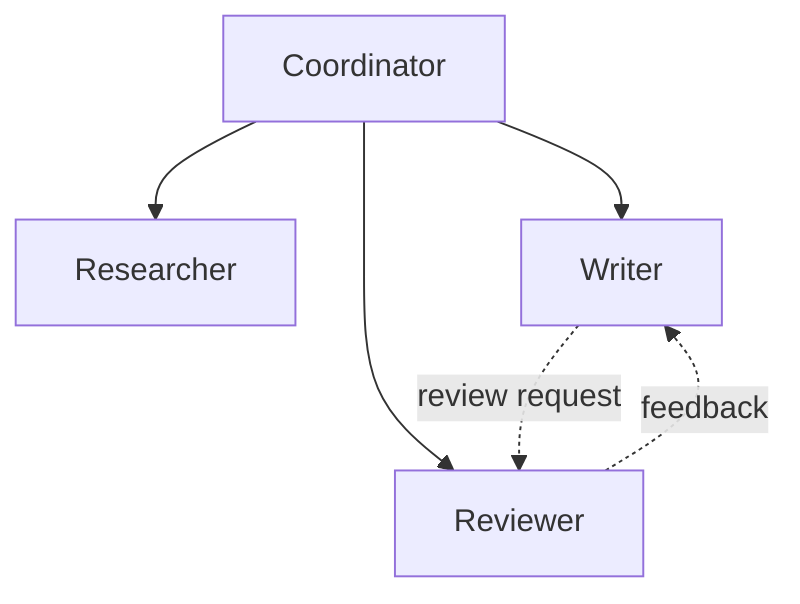

# Multi-Agent Design

Guides the user through designing multi-agent systems. Based on "Principles of Building AI Agents" (Bhagwat & Gienow, 2025), Part VI: Multi-Agent Systems (Chapters 21-26).

## When to use

Use this skill when the user needs to:
- Design a system with multiple collaborating agents
- Define agent roles and supervision hierarchy
- Plan control flow between agents
- Decide on communication patterns (supervisor, peer-to-peer, A2A)
- Compose agents and workflows together

## Instructions

### Step 1: Do You Need Multi-Agent?

Use the `AskUserQuestion` tool to assess:

**Single agent is enough when:**
- One domain, one task type
- < 10 tools
- Simple linear workflows
- One user persona

**Multi-agent is needed when:**
- Multiple distinct domains or expertise areas
- > 15 tools (performance degrades with tool count)
- Creative tasks need separation from analytical tasks
- Different parts of the system need different models or permissions
- You need peer review or quality checks between steps

If single agent is sufficient, recommend `agent:design` instead and stop.

### Step 2: Organizational Design

Apply the principle: **Design multi-agent systems like organizational design.**

Use `AskUserQuestion` to walk through:

1. **List all roles** — if humans did this work, what job titles would they have?
2. **Group by expertise** — same domain knowledge = same agent
3. **Separate creative from analytical** — generators vs. reviewers
4. **Define supervision** — who manages whom?

```markdown
## Agent Organization

### Agent Roster
| Agent | Role | Expertise | Model | Tools |
|-------|------|-----------|-------|-------|
| [Coordinator] | Manager | Task routing, planning | [Opus/GPT-4o] | [subordinate agents as tools] |
| [Researcher] | Specialist | Information gathering | [Sonnet/GPT-4o] | [search, web, RAG] |
| [Writer] | Specialist | Content generation | [Sonnet/GPT-4o] | [document tools] |
| [Reviewer] | Quality | Review and feedback | [Sonnet/GPT-4o] | [analysis tools] |

### Org Chart
```



### Step 3: Supervision Pattern

Choose how agents are coordinated:

```markdown
## Supervision Pattern

### Option A: Agent Supervisor
A dedicated agent manages other agents (passed as tools).
- **How:** Subordinate agents are registered as tools for the supervisor
- **Pros:** Flexible, supervisor decides strategy
- **Cons:** Supervisor is an LLM — may make unpredictable routing decisions
- **Best for:** Open-ended tasks, research, creative work

### Option B: Workflow Orchestrator
A deterministic workflow calls agents at defined steps.
- **How:** Workflow defines execution order; agents are steps
- **Pros:** Predictable, traceable, testable
- **Cons:** Less flexible, can't adapt at runtime
- **Best for:** Business processes, pipelines, compliance-heavy domains

### Option C: Hybrid
Workflow handles the skeleton; agents handle unstructured decisions within steps.
- **How:** Workflow calls agents as steps; agents have local autonomy
- **Pros:** Best of both — structure + flexibility
- **Best for:** Most production systems
```

Use `AskUserQuestion` to choose the pattern.

### Step 4: Control Flow Design

Design how agents communicate and make decisions:

```markdown
## Control Flow

### Planning Phase
Agents should establish an approach BEFORE executing — like a PM specs features before engineering builds.

1. **Coordinator receives task**
2. **Coordinator creates a plan** (which agents, in what order, with what inputs)
3. **Human reviews plan** (optional HITL checkpoint)
4. **Coordinator dispatches to specialists**
5. **Specialists execute and report back**
6. **Coordinator synthesizes results**

### Communication Pattern
| Pattern | Description | When to Use |
|---------|------------|-------------|
| **Sequential handoff** | Agent A → Agent B → Agent C | Tasks have dependencies |
| **Parallel dispatch** | Agent A + Agent B simultaneously | Independent subtasks |
| **Review loop** | Writer → Reviewer → Writer (iterate) | Quality-critical output |
| **Gossip/consensus** | All agents discuss until agreement | Collaborative decision-making |
| **Manager decision** | Supervisor collects inputs, decides | Efficiency over consensus |

### Decision Points
| Decision | Who Decides | Based On |
|----------|------------|----------|
| Task routing | [Coordinator / Workflow] | [Intent classification / Step order] |
| Quality check | [Reviewer agent] | [Eval criteria] |
| Escalation | [Coordinator] | [Confidence score / Error count] |
| Final output | [Coordinator / Human] | [All agent outputs] |
```

### Step 5: Agent-as-Tool & Workflow-as-Tool

Design the composition pattern:

```markdown
## Composition

### Agents as Workflow Steps
Workflow orchestrates; agents are individual steps.

| Workflow Step | Agent | Autonomy Level |
|--------------|-------|----------------|
| Step 1: Research | Research Agent | High (decides what to search) |
| Step 2: Draft | Writer Agent | Medium (follows outline from Step 1) |
| Step 3: Review | Reviewer Agent | High (independent quality check) |
| Step 4: Revise | Writer Agent | Low (follows reviewer feedback) |

### Workflows as Agent Tools
Agent decides WHICH workflow to run; workflow ensures HOW.

| Tool (Workflow) | Description for Agent | When Agent Should Call |
|----------------|----------------------|----------------------|
| research_workflow | Comprehensive multi-step research on a topic | When user needs deep analysis |
| publish_workflow | Draft → Review → Edit → Publish pipeline | When content is ready to publish |
| onboarding_workflow | New user setup: profile → preferences → tutorial | When a new user joins |
```

### Step 6: Inter-Agent Standards (A2A)

If agents cross trust boundaries or frameworks:

```markdown
## Agent-to-Agent Protocol (A2A)

### When to Use A2A
- [ ] Agents built in different frameworks need to communicate
- [ ] Agents are maintained by different teams/organizations
- [ ] You need standardized agent discovery and capability advertising

### A2A vs MCP
| Protocol | Purpose | Analogy |
|----------|---------|---------|
| **MCP** | Agent ↔ Tool connection | USB port for peripherals |
| **A2A** | Agent ↔ Agent connection | HTTP between microservices |

### A2A Implementation (if needed)
- **Discovery:** `/.well-known/agent.json` metadata file
- **Task lifecycle:** submitted → working → input-required → completed / failed / canceled
- **Communication:** HTTP + JSON-RPC 2.0
- **Streaming:** SSE for real-time updates
- **Auth:** Standard web authentication (OAuth, API keys)
```

Use `AskUserQuestion` — most systems do NOT need A2A. Skip if agents are all within the same codebase.

### Step 7: Failure Handling

```markdown
## Failure Handling

### Agent Failure Modes
| Failure | Detection | Recovery |
|---------|-----------|----------|
| Agent timeout | Max execution time | Retry with simplified task |
| Agent hallucination | Review agent or guardrail | Request regeneration with stricter prompt |
| Agent loop | Max iterations counter | Break loop, escalate to supervisor |
| Tool failure | Error response | Feed error to agent for retry (Pattern 9) |
| Coordination failure | Conflicting outputs | Supervisor arbitrates or requests human input |

### Graceful Degradation
- If specialist agent fails, can supervisor handle the task directly?
- If reviewer agent is unavailable, can output go to human review?
- If the whole system is degraded, what is the minimal viable response?
```

### Step 8: Summarize and Offer Next Steps

Present all findings to the user as a structured summary in the conversation (including the org chart diagram). Do NOT write to `.specs/` — this skill works directly.

Use `AskUserQuestion` to offer:
1. **Implement agents** — scaffold agent definitions, tools, and supervisor
2. **Design workflows** — run `agent:workflow` for each workflow identified
3. **Comprehensive design** — run `agent:design` to cover all areas with a spec

## Arguments

- `<args>` - Optional description of the system or path to existing agent code

Examples:
- `agent:multi content pipeline with writer and editor` — design a content pipeline
- `agent:multi src/agents/` — review existing multi-agent setup
- `agent:multi` — start fresh
