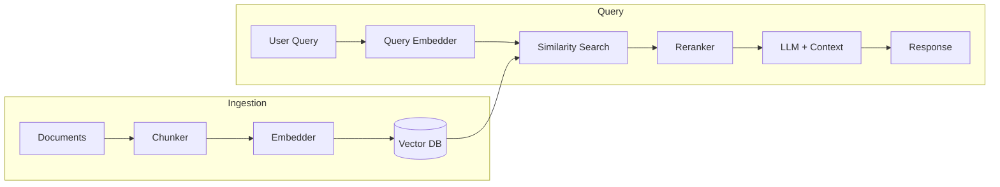

# RAG Pipeline Design

Guides the user through designing a Retrieval-Augmented Generation (RAG) pipeline. Based on "Principles of Building AI Agents" (Bhagwat & Gienow, 2025), Part V: RAG (Chapters 17-20).

## When to use

Use this skill when the user needs to:
- Design a RAG pipeline for an agent
- Choose a vector database
- Configure chunking, embedding, and retrieval
- Evaluate whether RAG is even needed (vs. alternatives)
- Tune an existing RAG pipeline for better quality

## Instructions

### Step 1: Do You Actually Need RAG?

Before building a pipeline, apply the principle: **Start simple, check quality, get complex.**

Use `AskUserQuestion` to assess:

```markdown
## RAG Decision Tree

### Step 1: How large is your corpus?
- **< 200 pages** → Try full context loading first (Gemini 2M, Claude 200K)
- **200-10,000 pages** → Consider agentic RAG (tools that query data) OR traditional RAG
- **> 10,000 pages** → Traditional RAG pipeline is likely needed

### Step 2: What is the query pattern?
- **Factual lookup** ("What is X?") → RAG works well
- **Analytical** ("Compare X and Y across documents") → Agentic RAG may be better
- **Conversational** ("Tell me about...") → Either works

### Step 3: How structured is the data?
- **Highly structured** (tables, databases) → Use tools/APIs, not RAG
- **Semi-structured** (markdown, HTML) → RAG with format-specific chunking
- **Unstructured** (PDFs, free text) → Traditional RAG
```

**Recommended progression:**
1. First, load entire corpus into a large context window
2. Second, write functions to query the dataset, give to agent as tools
3. Only if 1 and 2 fail on quality, build a RAG pipeline

If the user decides RAG is needed, proceed. Otherwise, recommend the simpler alternative.

### Step 2: Chunking Strategy

Design how documents are split into retrievable pieces:

```markdown
## Chunking Strategy

### Method
| Strategy | Best For | Description |
|----------|----------|-------------|
| Recursive | General text | Splits by paragraph, then sentence, then character |
| Token-aware | LLM optimization | Splits by token count, respects model limits |
| Format-specific | Markdown/HTML/JSON | Uses document structure (headers, tags, keys) |
| Semantic | High quality needs | Uses LLM to identify natural topic boundaries |

**Selected:** [Strategy]

### Parameters
| Parameter | Value | Rationale |
|-----------|-------|-----------|
| Chunk size | [256-1024 tokens] | Balance: smaller = more precise, larger = more context |
| Overlap | [50-200 tokens] | Prevents losing context at chunk boundaries |
| Metadata | [title, source, date, section, page] | Enables filtered retrieval |

### Document-Specific Rules
| Document Type | Chunking Rule |
|--------------|---------------|
| [Markdown docs] | Split on ## headers, keep header as metadata |
| [PDFs] | Page-based with overlap, extract title/section |
| [Code files] | Function/class-level chunks |
| [Chat logs] | Message groups of [N] turns |
```

### Step 3: Embedding Configuration

Choose how chunks become vectors:

```markdown
## Embedding

### Model Selection
| Model | Dimensions | Quality | Cost | Speed |
|-------|-----------|---------|------|-------|
| OpenAI text-embedding-3-large | 3072 | High | $0.13/M tokens | Fast |
| OpenAI text-embedding-3-small | 1536 | Good | $0.02/M tokens | Fast |
| Voyage voyage-3 | 1024 | High | $0.06/M tokens | Fast |
| Cohere embed-v3 | 1024 | High | $0.10/M tokens | Fast |
| Local (e5-large, BGE) | 1024 | Good | Free (compute) | Varies |

**Selected:** [Model]

### Indexing
| Parameter | Value |
|-----------|-------|
| Dimensions | [From model] |
| Similarity metric | Cosine (most common) |
| Index type | HNSW (default, good balance of speed/accuracy) |
```

### Step 4: Vector Database Selection

Apply the principle: **Prevent infra sprawl — vector DB choice is mostly commoditized.**

Use `AskUserQuestion`:

```markdown
## Vector Database

### Decision Matrix
| Option | When to Choose | Pros | Cons |
|--------|---------------|------|------|
| **pgvector** (Postgres extension) | Already using Postgres | No new infra, familiar SQL, metadata filtering | May need tuning at scale |
| **Pinecone** (managed) | New project, want simplicity | Fully managed, fast, scalable | Additional service + cost |
| **Chroma** (open-source) | Local dev, small scale | Free, easy setup | Self-host in production |
| **Cloud-native** (Cloudflare, DataStax) | Already on that cloud | Integrated billing, low latency | Vendor lock-in |

**Selected:** [Database]
**Rationale:** [Why]
```

### Step 5: Retrieval Configuration

Design how the agent queries the vector store:

```markdown
## Retrieval

### Query Strategy
| Parameter | Value | Rationale |
|-----------|-------|-----------|
| topK | [3-10] | Number of chunks to retrieve |
| similarityThreshold | [0.7-0.9] | Min relevance to include |
| reranking | [Yes/No] | Post-retrieval quality boost |

### Hybrid Queries
Combine vector similarity with metadata filters:

| Filter | Type | Example |
|--------|------|---------|
| Date range | Metadata | Only docs from last 30 days |
| Category | Metadata | Only "technical" documents |
| Source | Metadata | Only from "docs.example.com" |
| User access | Metadata | Only docs user has permission to see |

### Reranking (Optional)
- **When to use:** Quality matters more than latency
- **How:** Retrieve topK * 3 candidates, rerank with a cross-encoder, return topK
- **Models:** Cohere Rerank, bge-reranker, cross-encoder/ms-marco
- **Cost:** More expensive per query, but runs only on candidates (not full corpus)

### Query Transformation (Optional)
- **HyDE:** Generate a hypothetical answer, use it as the search query
- **Multi-query:** Generate multiple query variations, merge results
- **Step-back:** Abstract the query to a higher level, then search
```

### Step 6: Pipeline Architecture

Bring it all together:

```markdown
## RAG Pipeline

### Ingestion Pipeline
1. **Load** documents from [source]
2. **Chunk** using [strategy] with [size] tokens, [overlap] overlap
3. **Enrich** metadata: source, date, category, section
4. **Embed** using [model]
5. **Upsert** into [vector DB]
6. **Schedule:** [On change / Nightly / Manual]

### Query Pipeline
1. **Receive** user query
2. **Transform** query (optional: HyDE, multi-query)
3. **Embed** query using [same model as ingestion]
4. **Search** vector DB: topK=[N], filters=[metadata filters]
5. **Rerank** results (optional)
6. **Inject** top chunks into LLM context as <retrieved_documents>
7. **Generate** response with source attribution

### Architecture Diagram
```



### Step 7: Quality Checklist

```markdown
## RAG Quality Checklist

### Retrieval Quality
- [ ] Relevant documents consistently in top-K results
- [ ] Metadata filters working correctly
- [ ] No duplicate chunks in results
- [ ] Chunk size balances precision vs. context

### Generation Quality
- [ ] Responses are grounded in retrieved documents
- [ ] Source attribution is accurate
- [ ] Agent says "I don't know" when no relevant chunks found
- [ ] No hallucination beyond retrieved context

### Operational
- [ ] Ingestion pipeline runs on schedule
- [ ] New documents are available within [SLA]
- [ ] Vector DB latency < [target]ms
- [ ] Embedding costs within budget
```

### Step 8: Summarize and Offer Next Steps

Present all findings to the user as a structured summary in the conversation (including the pipeline diagram). Do NOT write to `.specs/` — this skill works directly.

Use `AskUserQuestion` to offer:
1. **Implement pipeline** — scaffold ingestion and query code
2. **Skip RAG** — if the decision tree said RAG isn't needed, help with the alternative (full context or agentic tools)
3. **Comprehensive design** — run `agent:design` to cover all areas with a spec

## Arguments

- `$ARGUMENTS` (`$0`) - Optional description of the knowledge domain or path to existing RAG code

Examples:
- `agent:rag documentation search` — design RAG for a docs search agent
- `agent:rag src/rag/` — review and tune existing RAG pipeline
- `agent:rag` — start fresh
