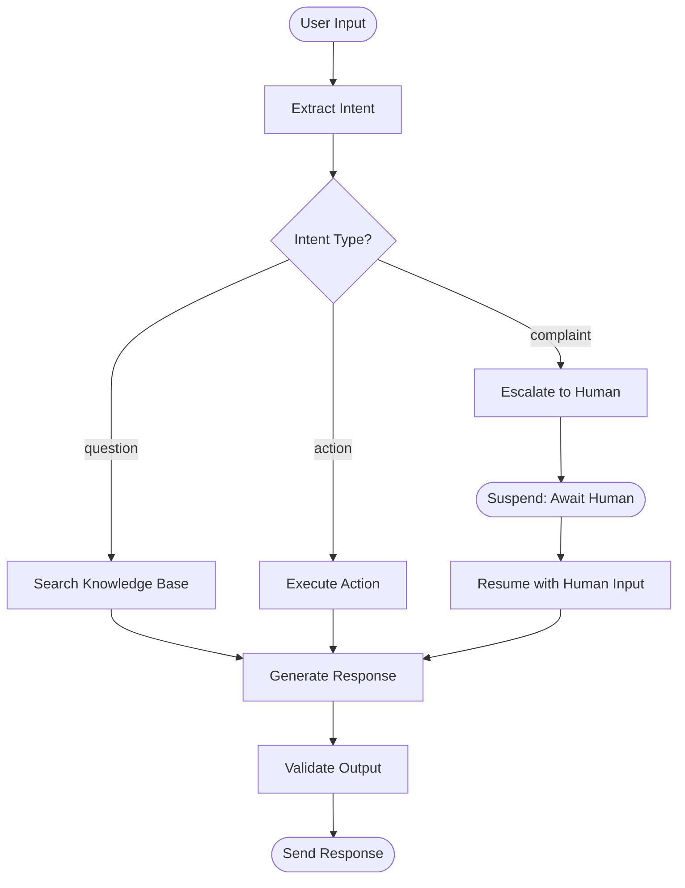

# Workflow Design

Guides the user through designing graph-based workflows for AI agents. Based on "Principles of Building AI Agents" (Bhagwat & Gienow, 2025), Part IV: Graph-Based Workflows (Chapters 12-16).

## When to use

Use this skill when the user needs to:
- Break down a complex agent task into structured workflow steps
- Design branching, chaining, and merging logic
- Plan human-in-the-loop suspend/resume points
- Set up streaming for real-time progress updates
- Design observability and tracing for workflows

## Instructions

### Step 1: Understand the Process

Use the `AskUserQuestion` tool to gather context:
1. What is the end-to-end process? (describe the full flow)
2. Is the agent too unpredictable for the task? (if yes, workflows add structure)
3. Are there steps that must happen in a specific order?
4. Are there steps that can run in parallel?
5. Are there points where human input is needed?
6. Does the user need real-time progress updates?

Read any existing spec documents before proceeding.

**Key principle:** Use workflows when agents are too unpredictable. Workflows define explicit branching, parallel execution, checkpoints, and tracing.

### Step 2: Workflow Primitives

Teach the four workflow primitives and map the user's process to them:

```markdown
## Workflow Primitives

### 1. Chaining (Sequential)
Steps run one after another. Each step has access to the previous step's output.
- Use when: step B depends on step A's result
- Example: Extract data → Validate → Transform → Store

### 2. Branching (Parallel)
Multiple steps run simultaneously on the same input.
- Use when: independent analyses of the same data
- Example: Analyze sentiment + Extract entities + Classify topic (all in parallel)

### 3. Merging (Convergence)
Combine results from multiple branches into a single output.
- Use when: parallel branches need to produce a unified result
- Example: Combine sentiment + entities + topic into a single report

### 4. Conditions (Decision Points)
Route to different steps based on intermediate results.
- Use when: different inputs require different processing paths
- Example: If user intent = "complaint" → escalation flow; else → standard flow
```

### Step 3: Design the Workflow Graph

Walk through the process step by step. Use `AskUserQuestion` to confirm each step.

**Design rules:**
- Each step does ONE thing (no more than one LLM call per step)
- Input/output at each step should be meaningful and inspectable
- Name steps clearly — they appear in traces

Output a Mermaid diagram:



And a step table:

```markdown
## Workflow Steps

| # | Step | Type | LLM Call | Input | Output | Notes |
|---|------|------|----------|-------|--------|-------|
| 1 | Extract Intent | Chain | Yes (classification) | User message | intent: string | Zero-shot classification |
| 2 | Route | Condition | No | intent | branch selection | Deterministic routing |
| 3a | Search KB | Chain | No (tool call) | query from intent | documents[] | RAG retrieval |
| 3b | Execute Action | Chain | Yes (tool use) | action from intent | result | Agent with tools |
| 3c | Escalate | Suspend | No | complaint details | human input | Wait for human |
| 4 | Generate Response | Chain | Yes (generation) | context + data | response text | Few-shot prompted |
| 5 | Validate | Chain | Yes (judge) | response | pass/fail | Output guardrail |
```

### Step 4: Suspend/Resume Points

Identify where the workflow needs to pause for external input:

```markdown
## Suspend/Resume Points

| # | Trigger | What to Persist | Resume Signal | Timeout |
|---|---------|----------------|---------------|---------|
| 1 | Human approval needed | Full workflow state + pending action | Human clicks approve/reject | 24h |
| 2 | External API callback | Request ID + workflow state | Webhook from external service | 1h |
| 3 | User clarification | Conversation history + ambiguous input | User responds | 30min |

### Persistence Strategy
- **Storage:** [Database / Redis / Durable execution engine]
- **Serialization:** JSON-serializable workflow state
- **Cleanup:** Expire suspended workflows after [timeout]

### Key Principle
Do NOT keep running processes for long waits. Persist state, shut down, resume when the signal arrives.
```

Use `AskUserQuestion` to identify suspension points in the user's workflow.

### Step 5: Streaming Strategy

Design how progress flows to the user:

```markdown
## Streaming Strategy

### What to Stream
| Event Type | Content | When |
|-----------|---------|------|
| Step start | Step name + description | Each step begins |
| LLM tokens | Token-by-token response | During generation |
| Tool call | Tool name + status | Tool execution |
| Progress | Percentage or step count | Between steps |
| Custom data | Partial results, previews | When available |

### Implementation
- **Protocol:** SSE (Server-Sent Events) / WebSocket
- **Frontend:** Show step-by-step progress, auto-scroll, display tool calls
- **Escape hatches:** Push partial results even if the function is not done

### UX Principle
Users want to see progress, not a blank screen. Streaming makes agents feel faster and more reliable. Show what is happening at every moment.
```

### Step 6: Observability & Tracing

Design what to observe:

```markdown
## Observability

### Tracing Standard
- **Format:** OpenTelemetry (OTel) — industry standard
- **Structure:** Traces → Spans (tree of nested operations, like a flame chart)

### What to Trace
| Span | Attributes | Purpose |
|------|-----------|---------|
| Workflow run | workflow_id, user_id, start_time, status | Top-level trace |
| Each step | step_name, duration, status, input_tokens, output_tokens | Step-level detail |
| LLM call | model, prompt_tokens, completion_tokens, latency | Cost and performance |
| Tool call | tool_name, input, output, duration, status | Tool reliability |
| Guardrail | guard_name, triggered, action_taken | Security monitoring |

### Dashboards
- **Per-run view:** See every step, its duration, input/output (JSON inspector)
- **Aggregate view:** Success rate, avg latency, cost per run, error rate
- **Eval view:** Score per run, score over time, regression detection

### Tooling
| Tool | Purpose |
|------|---------|
| [LangSmith / Braintrust / custom] | Trace viewer + eval dashboard |
| [Grafana / Datadog] | Infrastructure metrics |
| [PagerDuty / OpsGenie] | Alerting on failure spikes |
```

### Step 7: Workflow Composition

If the agent system has multiple workflows, design how they compose:

```markdown
## Workflow Composition

### Workflows as Tools
Complex tasks become workflows, workflows become tools for agents.
- Agent decides WHICH workflow to run
- Workflow ensures HOW the task executes (structured, reliable)

### Agents as Workflow Steps
Agent calls can be individual steps in a larger workflow.
- Workflow orchestrates the sequence
- Agent handles the unstructured reasoning within a step

| Workflow | Used As | Called By |
|----------|---------|----------|
| [Research Workflow] | Tool | [Coordinator Agent] |
| [Code Review Workflow] | Step in Deploy Pipeline | [CI/CD Workflow] |
```

### Step 8: Generate Workflow Document

Compile into `.specs/<spec-name>/agent-workflow.md`:

```markdown
# Workflow Design: [System Name]

## Workflow Graph
[Mermaid diagram from Step 3]

## Steps
[Step table from Step 3]

## Suspend/Resume
[From Step 4]

## Streaming
[From Step 5]

## Observability
[From Step 6]

## Composition
[From Step 7]
```

### Step 9: Offer Next Steps

Use `AskUserQuestion` to offer:
1. **Implement the workflow** — scaffold workflow code
2. **Proceed to RAG design** — run `agent:rag` (if workflow uses retrieval)
3. **Proceed to multi-agent design** — run `agent:multi`
4. **Full review** — run `agent:review`

## Arguments

- `<args>` - Optional spec name
  - `<spec-name>` — reads existing agent design from `.specs/<spec-name>/`

Examples:
- `agent:workflow customer-support` — design workflow for the customer-support agent
- `agent:workflow` — start fresh
