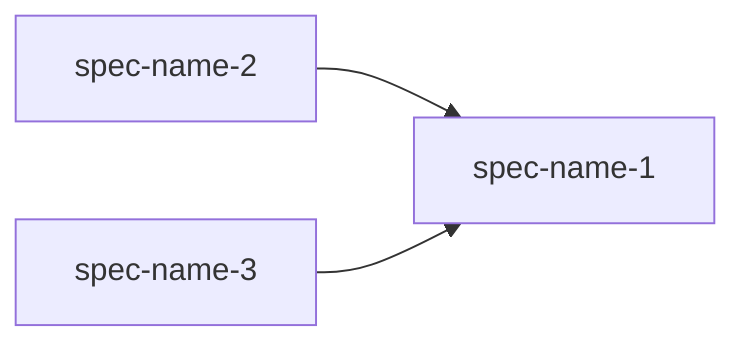

# Project Plan

Breaks a project vision into individual specifications with clear boundaries, dependencies between them, and an optimal execution order. Produces a dependency graph and identifies shared interfaces that multiple specs will consume.

## When to use

Use this skill when the user needs to:
- Break a large system into manageable, independent specs
- Define dependencies and execution order across specs
- Identify shared interfaces and contracts between modules

## Instructions

### Step 1: Read Project Vision

1. Look for `.projects/<project-name>/vision.md`
2. If the vision document does not exist, use the `AskUserQuestion` tool to suggest running `project:init` first, with options like "Run project:init first", "I'll provide context manually"
3. Extract: goals, stakeholders, technical constraints, shared architectural decisions, system boundary

### Step 2: Analyze the Codebase

If this is not a greenfield project:
1. Explore the existing codebase to identify existing modules, services, or components
2. Map existing code to potential spec boundaries
3. Identify integration points between existing modules

### Step 3: Propose Decomposition

Based on the vision and codebase analysis, identify natural spec boundaries. For each proposed spec, determine:
- **Purpose** — What this spec delivers (one sentence)
- **Boundary** — What is IN this spec and what is NOT
- **Dependencies** — Which other specs must be completed first
- **Complexity** — Small / Medium / Large

Present the proposed decomposition to the user via `AskUserQuestion`. Ask:
- Are these the right specs? Should any be split or merged?
- Are the boundaries clear? Any overlap?
- Are dependencies correct?

Iterate until the user confirms the decomposition.

### Step 4: Build Dependency Graph

1. Perform a topological sort on spec dependencies to determine execution order
2. Group specs into phases — specs in the same phase have no mutual dependencies and can be worked on in parallel
3. Identify any circular dependencies and resolve them with the user

### Step 5: Identify Shared Interfaces

For specs that depend on each other, define the contracts between them:
- Data types or interfaces that cross spec boundaries
- API contracts that one spec provides and another consumes
- Shared entities (e.g., User, Organization) that multiple specs reference

These interfaces are defined at the project level so individual specs can reference them without duplicating definitions.

### Step 6: Create the Specs Document

Create the document at `.projects/<project-name>/plan.md` with this structure:

```markdown
# Project Plan: [Name]

## Specs

### 1. [spec-name]: [Title]
- **Purpose:** [What this spec delivers]
- **Boundary:** [What is IN / what is NOT in this spec]
- **Depends on:** [spec names, or "none"]
- **Complexity:** [Small / Medium / Large]
- **Status:** [ ] Not started

### 2. [spec-name]: [Title]
- **Purpose:** [What this spec delivers]
- **Boundary:** [What is IN / what is NOT in this spec]
- **Depends on:** [spec-name-1]
- **Complexity:** [Medium]
- **Status:** [ ] Not started

[Continue for all specs]

## Dependency Graph



## Execution Order

| Phase | Specs | Parallelizable? |
|-------|-------|-----------------|
| 1 | spec-name-1 | - |
| 2 | spec-name-2, spec-name-3 | Yes |
| 3 | spec-name-4 | - |

## Shared Interfaces

### [Interface Name]
**Defined by:** [spec-name] | **Consumed by:** [spec-names]

```typescript
interface Example {
  id: string;
  // ...
}
```

[Continue for all shared interfaces]
```

### Writing Guidelines

1. **One responsibility per spec** — Each spec should deliver one coherent piece of functionality
2. **Clear boundaries** — Explicitly state what is NOT in the spec to prevent scope creep
3. **Minimize dependencies** — Prefer independent specs where possible; fewer dependencies = more parallelism
4. **Right-size specs** — Too small creates overhead, too large becomes unmanageable. Aim for specs that take 1-5 implementation sessions
5. **Shared interfaces are contracts** — Define them precisely; they are the API between specs

### Step 7: Confirm with User

After creating the document, present:
1. The location of the created file
2. Total number of specs and phases
3. The dependency graph
4. Use the `AskUserQuestion` tool to ask if they want to make changes or start working, with options like "Looks good, start with first spec", "I want to adjust boundaries", "Review decomposition first"

Suggest running `spec:requirements <first-spec-name>` for the first spec in Phase 1.

## Arguments

This skill accepts an optional argument:
- `$ARGUMENTS` - The project name to decompose
  - `$0` — project name (e.g., "my-saas")

If `$0` is provided, use it as the project name. If not provided, scan `.projects/` for existing projects and ask the user which one to decompose.

Examples:
- `project:plan my-saas` - Decompose the "my-saas" project
- `project:plan` - Will ask which project to decompose
