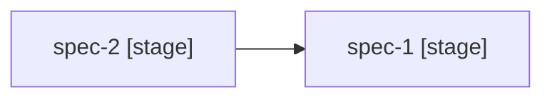

# Project Status

Displays a dashboard showing the progress of all specs in a project. Scans spec directories to determine each spec's current stage, task completion, and test results. Identifies blocked and ready-to-start specs based on the dependency graph.

## When to use

Use this skill when the user needs to:
- See overall progress of a multi-spec project
- Determine which spec to work on next
- Identify blocked specs and their blockers
- Get a quick summary of project health

## Instructions

### Step 1: Find the Project

1. Scan `.projects/` for project directories
2. If multiple projects exist, use the `AskUserQuestion` tool to ask which one to show
3. If no projects exist, inform the user and suggest running `project:init` first
4. If `$0` specifies a project name, use it directly

### Step 2: Read Project Data

1. Read `.projects/<project-name>/plan.md` to get the list of specs with dependencies
2. Read `.projects/<project-name>/vision.md` for project name and goals context

### Step 3: Scan Spec Progress

For each spec listed in `plan.md`, scan `.specs/<spec-name>/` to determine:

**Stage detection** (based on which files exist and checkbox progress — there is no approval status):

| Condition | Stage | Health |
|---|---|---|
| No documents exist | Not started | — |
| `requirements.md` exists, no `research.md`/`design.md` | Requirements | Ready for research |
| `research.md` exists, no `design.md` | Research | Ready for design |
| `design.md` exists, no `tasks.md` | Design | Ready for tasks |
| `tasks.md` exists, no `[x]` or `[-]` | Tasks | Ready for implementation |
| `tasks.md` has `[-]` or `[x]` (not all `[x]`) | Implementing | In progress |
| `tasks.md` all `[x]` | Implemented | Ready for testing |
| `test-plan.md` has `[-]` or `[x]` | Testing | In progress |
| `test-plan.md` all `[x]` | Complete | Done |

**Task progress** (if `tasks.md` exists):
- Count checkboxes: `[x]` = done, `[-]` = in progress, `[ ]` = pending
- Report as "N/M done" (e.g., "8/12 done")

**Test progress** (if `test-plan.md` exists):
- Count: `[x]` = passed, `[!]` = failed, `[s]` = skipped, `[ ]` = pending
- Report as "N passed / M total"

### Step 4: Determine Blocked/Ready Status

For each spec that has not started:
1. Check its dependencies from `plan.md`
2. A dependency is "met" if the dependent spec has reached at least the "Implemented" stage
3. A dependency is "partially met" if the dependent spec is in the "Implementing" stage
4. **Blocked** — at least one dependency has not reached "Implementing" stage
5. **Ready** — all dependencies are met or partially met

### Step 5: Present the Dashboard

Display the following to the user:

```
# Project Status: [name]

## Progress

| Spec | Stage | Docs | Tasks | Tests | Status |
|------|-------|------|-------|-------|--------|
| [name] | [stage] | [R D T] | [N/M done] | [N/M passed] | [Ready/Blocked/In Progress/Complete] |

Include a `Docs` column showing which documents exist as a compact set of letters: `R D T` means requirements + design + tasks exist (R=requirements, S=research, D=design, T=tasks, P=test-plan). Omit a letter if that document is missing.

## Dependency Graph



## Ready to Start
- [spec-name] — all dependencies met

## Blocked
- [spec-name] — waiting for: [dependency-spec]

## Suggested Next Action
[Context-aware suggestion based on current state]
```

### Step 6: Suggest Next Action

Based on the current state, suggest the most useful next action via `AskUserQuestion`:

- If a spec is in progress → "Continue with `spec:implement <name>`"
- If specs are ready to start → "Start planning with `spec:requirements <name>`"
- If a spec just finished implementation → "Create test plan with `spec:test-plan <name>`"
- If a spec's latest document needs a quality check → suggest `spec:review <name>`
- If all specs are complete → "Project is complete!"

Provide 2-3 options matching the current project state.

## Arguments

This skill accepts an optional argument:
- `$0` - The project name to show status for

If `$0` is provided, use it as the project name. If not provided, scan `.projects/` for existing projects.

Examples:
- `project:status my-saas` - Show status of the "my-saas" project
- `project:status` - Will auto-detect or ask which project
