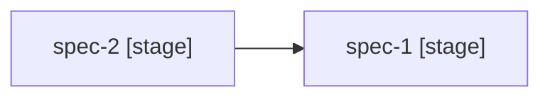

# Project Status

Displays a dashboard showing the progress of all specs in a project. Scans spec directories to determine each spec's current stage, task completion, and test results. Identifies blocked and ready-to-start specs based on the dependency graph.

## When to use

Use this skill when the user needs to:
- See overall progress of a multi-spec project
- Determine which spec to work on next
- Identify blocked specs and their blockers
- Get a quick summary of project health

## Instructions

### Step 1: Find the Project

1. Scan `.projects/` for project directories
2. If multiple projects exist, use the `AskUserQuestion` tool to ask which one to show
3. If no projects exist, inform the user and suggest running `project:vision` first
4. If `<args>` specifies a project name, use it directly

### Step 2: Read Project Data

1. Read `.projects/<project-name>/specs.md` to get the list of specs with dependencies
2. Read `.projects/<project-name>/vision.md` for project name and goals context

### Step 3: Scan Spec Progress

For each spec listed in `specs.md`, scan `.specs/<spec-name>/` to determine:

**Stage detection** (based on which files exist):

| Files present | Stage |
|---------------|-------|
| None | Not started |
| `requirements.md` | Requirements |
| `requirements.md` + `research.md` | Research |
| `requirements.md` + `design.md` | Design |
| `requirements.md` + `tasks.md` | Breakdown |
| `requirements.md` + `tasks.md` (with `[-]` or `[x]`) | Implementing |
| `requirements.md` + `tasks.md` (all `[x]`) | Implemented |
| `requirements.md` + `test-plan.md` | Testing |
| `requirements.md` + `test-plan.md` (all `[x]`) | Complete |

**Task progress** (if `tasks.md` exists):
- Count checkboxes: `[x]` = done, `[-]` = in progress, `[ ]` = pending
- Report as "N/M done" (e.g., "8/12 done")

**Test progress** (if `test-plan.md` exists):
- Count: `[x]` = passed, `[!]` = failed, `[s]` = skipped, `[ ]` = pending
- Report as "N passed / M total"

### Step 4: Determine Blocked/Ready Status

For each spec that has not started:
1. Check its dependencies from `specs.md`
2. A dependency is "met" if the dependent spec has reached at least the "Implemented" stage
3. A dependency is "partially met" if the dependent spec is in the "Implementing" stage
4. **Blocked** — at least one dependency has not reached "Implementing" stage
5. **Ready** — all dependencies are met or partially met

### Step 5: Present the Dashboard

Display the following to the user:

```
# Project Status: [name]

## Progress

| Spec | Stage | Tasks | Tests | Status |
|------|-------|-------|-------|--------|
| [name] | [stage] | [N/M done] | [N/M passed] | [Ready/Blocked/In Progress/Complete] |

## Dependency Graph



## Ready to Start
- [spec-name] — all dependencies met

## Blocked
- [spec-name] — waiting for: [dependency-spec]

## Suggested Next Action
[Context-aware suggestion based on current state]
```

### Step 6: Suggest Next Action

Based on the current state, suggest the most useful next action via `AskUserQuestion`:

- If a spec is in progress → "Continue with `spec:implement <name>`"
- If specs are ready to start → "Start planning with `spec:plan <name>`"
- If a spec just finished implementation → "Create test plan with `spec:test-plan <name>`"
- If all specs are complete → "Project is complete!"

Provide 2-3 options matching the current project state.

## Arguments

This skill accepts an optional argument:
- `<args>` - The project name to show status for

If `<args>` is provided, use it as the project name. If not provided, scan `.projects/` for existing projects.

Examples:
- `project:status my-saas` - Show status of the "my-saas" project
- `project:status` - Will auto-detect or ask which project
